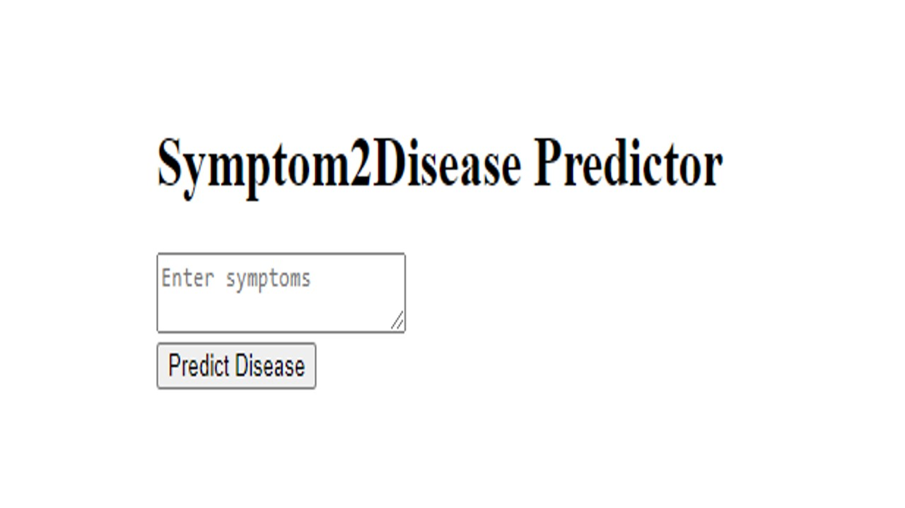

# Final Project

## Description

Dataset Overview: Symptom2Disease

Source: Kaggle

**Objective**: I am working with the 'symptom2disease' dataset to achieve one main goal: predict a disease based on the described symptoms. It's like having a basic diagnostic tool right at my fingertips.

Data specifications:

1. Rows: The dataset consists of 1,200 rows. Each disease is represented by 50 rows, detailing various associated symptoms.

2. Columns: The dataset has three primary columns:
Unnamed: Serving as an index, this column ensures each entry has a unique identifier.

3. Labels: This column lists the diseases, with a total of 24 unique ailments covered in the dataset.

4. Text: Descriptive in nature, this column provides detailed symptom descriptions associated with the diseases in the 'Labels' column.

This project is focused on predicting diseases from symptoms using unsupervised machine learning and natural language processing (NLP) techniques. 

I approach this problem by using two machine learning models, Linear Support Vector Classifier (LinearSVC) and Random Forest Classifier, and three different vectorization techniques, namely Count Vectorizer, Word2Vec, and TF-IDF (Term Frequency-Inverse Document Frequency).

## Project Structure

## Methodology

**Data Exploration**: In this step, I try to understand the data by looking more closely at the labels, what is the distribution of word counts of the text column and what is the distribution of the text length. I also try to see if there is any duplicate rows per disease. After identifying them, I remove the duplicated rows. By creating word clouds, I am able to visually see if the labels are correctly represented by their symptom descriptions. For certain diseases like Dengue, Migraine, Common cold and Diabetes the words that appear very large do not reflect the disease.

**Pre-processing**: In this phase, I refine the data by removing punctuations, numbers, and standard stopwords. In the second attempt of the project, I further enhance this process by introducing a custom list of stopwords and eliminating infrequent words. Next, I vectorize my text so that I can compute and store the frequency of each unique word present in the 'preprocessed_text' column of the dataset. This can be helpful for understanding word distribution, identifying common words, or filtering out infrequent words from the dataset. Finally, I encode the labels so that i can build my model to make predictions.

**Modelling**: In this phase, I divide the data into training and testing sets, followed by text vectorization. I experiment with two machine learning models: LinearSVC and RandomForest Classifier. Each model is trained and evaluated using three different vectorizers: CountVectorizer, Word2Vec, and TFIDF.

Vectorization is important because we convert text data into numerical format to feed into machine learning models. Using CountVectorizer with a limit of 5000 features ensures consistent input size, captures word importance, and helps in efficient computation by reducing dimensionality.

The next step is standardization which is important in order to ensure that all our features have the same scale. Features on the same scale allow for a more consistent interpretation of feature importance or coefficients in certain models.

Accuracy scores for each models are as follows:
CountVectorizer
LinearSVC: 94%
RandomForest Classifier: 98%

Word2Vec
LinearSVC: 9%
RandomForest Classifier: 64%

TF-IDF
LinearSVC: 93%
RandomForest Classifier: 96%

**Hyperparameter Tuning**

Best Parameters:

1. LinearSVC- {'C': 0.001, 'max_iter': 1000}

2. RandomForest Classifier- 
{'max_depth': None, 'min_samples_leaf': 1, 'min_samples_split': 2, 'n_estimators': 100}

Accuracy Scores after Hyperparameter Tuning

LinearSVC: 94%

RandomForest Classifier: 98%

**Model Evaluation and Analysis**

1. Cross Validation:
From the individual CV scores, I can observe that the accuracy for LinearSVC varies between approximately 92.4% to 97.8%. For RandomForestClassifier, the scores range from 88% to 95.65%. Both models consistently deliver a robust performance, with only minor fluctuations. This means that both models are able to predict the correct disease with high accuracy.

2. Confusion Matrix: From the confusion matrices of both models it can be observed that the LinearSVC Model has twice the number of misclassifications than the Random Forest Classifier. Also, in a few instances, the LinearSVC misclassifies the same disease more than once while the Random Forest Classifier does not exceed 1 misclassification for any disease. For example label 6 (Dengue) is predicted as label 4 (Dengue) 2 times by The LinearSVC and the Random Forest Classifier shows the same pattern but only once. Another example is label 17(Varicose Veins) which is predicted as label 4 (Chicken Pox) by the LinearSVC 2 times. However, the Random Forest Classifier does not make such mistake. It can be concluded that the Random Forest Classifier is able to predict a disease more accurately than the LinearSVC.

3. Predicted probabilities : The distribution of predicted probabilities of the RandomForest Classifier provide some better insights concerning the model performance. while it has a high accuracy score, the model is not very confident about its predictions. All the class probability distributions are prominently peaked at zero, implying a strong tendency of the model to be uncertain for a significant number of predictions. This is further evidenced by the overlapping curves from 0.2 to 1.2, suggesting a notable overlap in the model's confidence across multiple classes. This means that the model feels almost equally confident or uncertain about certain diseases. This can suggest that the model sometimes struggles to distinguish between  classes based on the provided symptoms. Since some diseases share common symptoms, the model is not able to distinguish between the diseases properly or with confidence.

4. Heatmap for RandomForest: The heatmap visualizes the frequency with which the RandomForest model predicts one disease as its primary choice and another as its secondary based on predicted probabilities. It highlights potential confusions, such as the model mistaking Dengue for Chicken Pox multiple times, suggesting overlapping symptom descriptions for certain diseases.

**Conclusion**: The RandomForest Classifier outperforms the LinearSVC but still occasionally misclassifies specific diseases, as evidenced in the evaluation and analysis section. Refining data cleaning in the subsequent attempt yields better scores and improved prediction probabilities, suggesting further data preprocessing or exploration of alternative models might be beneficial.

**Deployment**

This is my Disease Predictor app

**Challenges & Learnings**: Dealing with text data was a novel challenge, particularly discerning the significance of shared terms across various diseases. Determining the relevance of words and deciding on their retention or removal was a nuanced task, and establishing a strategy for effective textual exploration proved to be a learning curve.. Hyperparameter tuning was time-intensive, taking six hours per run, limiting iterations with further preprocessing or model exploration. Diverse model testing deepened my understanding of their intricacies and performance determinants.

**Future Scope**: I aim to refine my model performance by filtering out irrelevant words or noise. The challenge lies in discerning which terms to exclude without compromising model accuracy. This warrants further investigation and experimentation.

